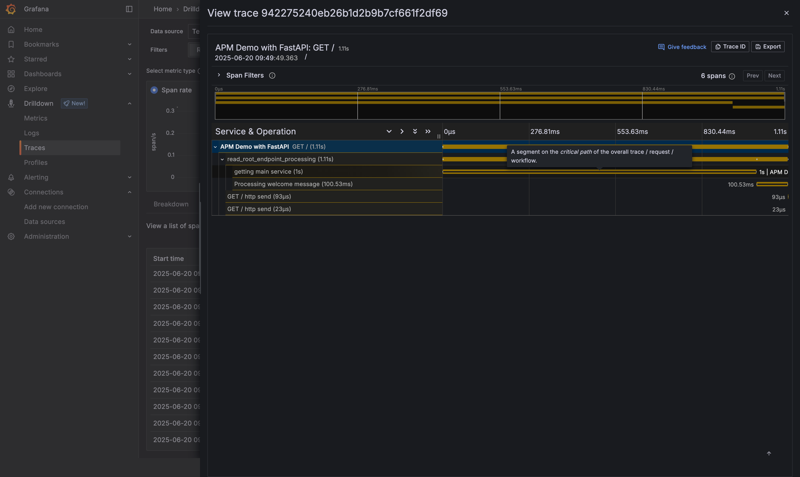

# TeleScope

Replicating Datadog APM with open source tooling.



TODO
- Update the app to be more autonomously generating data
- Make a good database data and queries
- Drill down feature with prometheus metrics of traces


## Components
The stack consists of the following components:

**FastAPI Application:** A simple Python web application built with FastAPI, instrumented to emit OpenTelemetry traces.

**OpenTelemetry Collector (otel-collector):** Acts as a central hub for collecting, processing, and routing telemetry data (traces and metrics) from the FastAPI application to Tempo and Prometheus.

**Grafana Tempo (tempo):** A high-volume, minimal-dependency distributed tracing backend that stores and queries traces. It includes a metrics_generator to derive service graph and RED (Rate, Error, Duration) metrics from traces.

**Prometheus (prometheus):** A monitoring system that collects and stores time-series data. It receives metrics pushed from Tempo's metrics_generator.

**Grafana (grafana):** A powerful open-source platform for analytics and monitoring. It queries Tempo for traces and Prometheus for metrics, providing rich dashboards for visualization.

## Architecture
The data flow within this observability stack is as follows:

```
+----------------+       +-------------------+       +---------------+          +--------------------------------+  
| FastAPI App    | ----> | OpenTelemetry     | ----> | Grafana       |          |                                |  
| (OTEL Tracing) |       | Collector         |       | Tempo         |  <-----  |     Grafana Visualizations     |  
+----------------+       | (OTLP Receiver)   |       | (Trace Store) |          |       Tempo & Prometheus       |. ---  
                         | (Batch Processor) |       +---------------+          |                                |.   |
                         | (OTLP/Tempo Exp)  |              |                   +--------------------------------+.   |
                         +-------------------+              |                                                         |
                                                            |                                                         |
                                                            | (Metrics Generator - Prometheus Remote Write Rx).       |
                                                            |                                                         |
                                                            V                                                         |
                                                      +------------+                                                  |
                                                      | Prometheus | <-------------------------------------------------
                                                      +------------+
```

## Getting Started

```make
make up
make setup-uv
make all
make call-endpoints
```